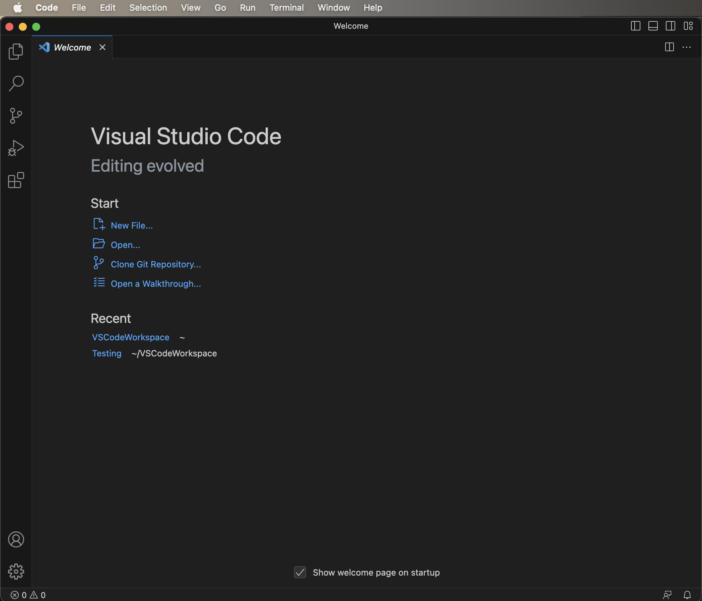
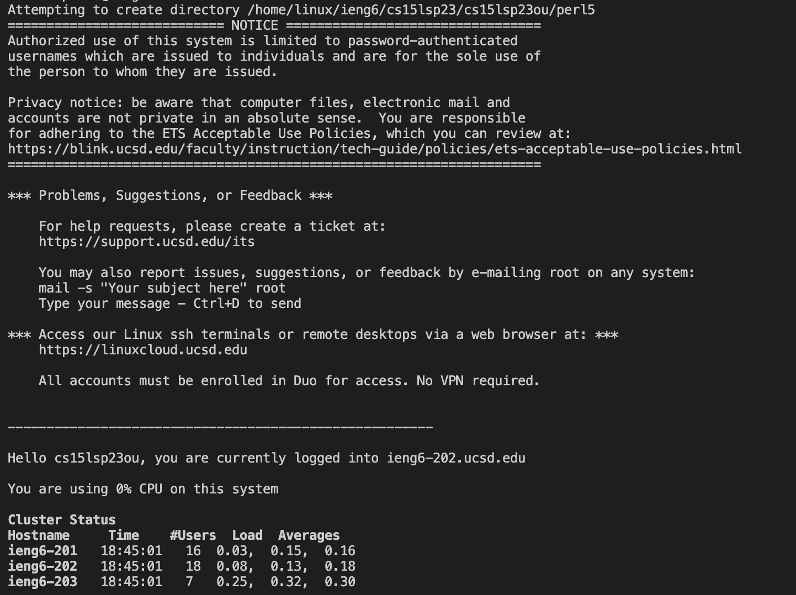
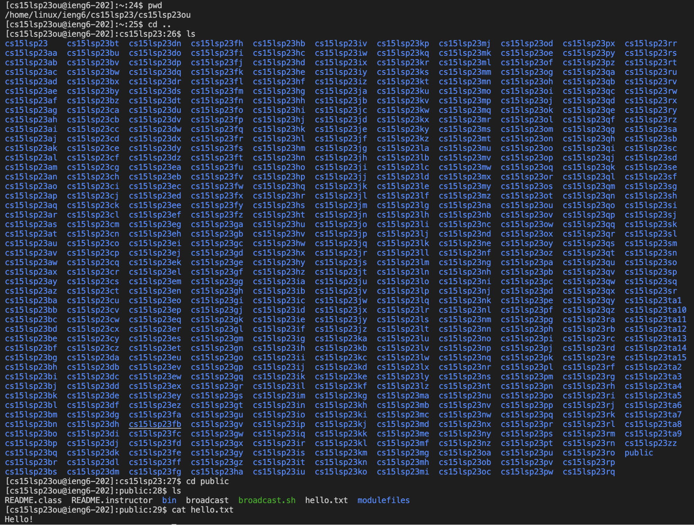

# Lab Report 1
Name: Arjun Sarup

PID: A17527244

Email: asarup@ucsd.edu

---

## Introduction
Hello, future students of CSE 15L! This is a brief tutorial for lab 1. In this report, I'll talk about installing VS Code, remotely connecting to a server in the CSE Basement, and running some basic commands on that server.

## Installing VS Code
If you don't currently have Visual Studio Code installed on your laptop, the first step is to download this software. Head to [https://code.visualstudio.com/](https://code.visualstudio.com/) and follow the instructions for installing the software there. I didn't have VS Code installed prior to this lab either, but the process is really simple; all you have to do is download the file, un-zip it, and move the app to the desired file path on your laptop. Once that's done, you can open the VS Code app on your laptop. It should look something like this when you open it up:

From there, select "Terminal" from the header and then "New Terminal" from the dropdown. This will allow you to run terminal commands through VS Code.

## Remotely Connecting
First, if you haven't yet reset your CSE 15L password, do so [here](https://sdacs.ucsd.edu/~icc/index.php). Further instructions for this process can be found [here](https://drive.google.com/file/d/17IDZn8Qq7Q0RkYMxdiIR0o6HJ3B5YqSW/view) if needed. Once that's done, Windows users need to install `git` (I'm a mac user, so I didn't need to do this step), which can be done from this [site](https://gitforwindows.org/). 

With all that taken care of, we can start remotely connecting to computers. In the terminal, run the command `$ ssh cs15lsp23ou@ieng6.ucsd.edu`, with the `ou` replaced by whichever letters are used in your username for CSE 15L. The terminal will prompt you for your password, so type it in and hit enter. If, for some reason, the terminal raises some sort of error, try using the command `$ ssh cs15lsp23ou@ieng6-[XXX].ucsd.edu`, where `[XXX]` is `201`, `202`, or `203`. This happened to me and the command worked once I tried specifying which server I would connect to with `202`. The result should look something like this:

Congratulations! You're now connected to a remote server.

## Running Some Commands

Now that you're connected, try running some commands on the remote server! I started with `pwd` to see my working directory, and navigated through some files with `cd` and `ls`. I made it to the `public` path and found a file called `hello.txt`, whose contents I printed out using the `cat` command. Here is a screenshot of my results:

Feel free to experiment with some other commands, like `cp /home/linux/ieng6/cs15lsp23/public/hello.txt ~/` if you want to copy the `hello.txt` file in the public directory into the user directory, or `ls -a` if you want to see all the files (including hidden files) in the current directory. And that's about it! Once you're done, log out of the remote server by using Ctrl + D or the `exit` command.
